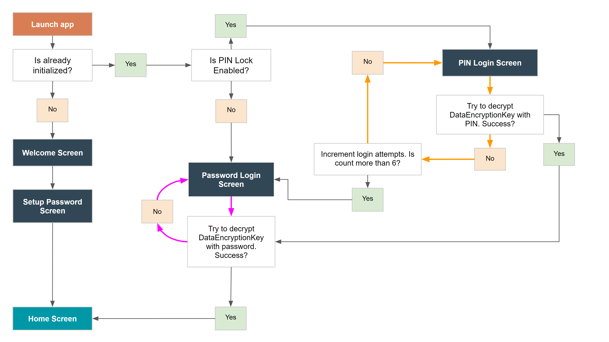

<!-- Title -->
<h1 align="center">Be Well</h1>

<h2 align="center">Open source wellbeing tracker app with a focus on data privacy</h2>
  
 

What affects our wellbeing? What causes us to feel happy or upset? Sometimes we are having the worst luck or a busy and challenging day but we feel happy and collected. Yet other times we feel cranky even when everything seems to be going great. Lets try to discover some trends in our daily lives and influences on our wellbeing.

 

- [Introduction](#-introduction)
- [Features](#-features)
- [Technologies](#-technologies)
- [Using the app](#-using-the-app)
- [Security and Storage](#-security-and-storage)
- [The Team](#-the-team)
- [Design](#-design)
- [Contact](#-contact)

 

## Introduction

Be Well app helps you track your moods, sleep and save notes and images throughout the day without worrying about your data being sent to servers and sold to advertizers or other third parties. Your data is yours. It is stored encrypted and stays on your device.

  

## Features

 

- Quick and easy mood and sleep rating by tapping on icons
- Allows adding notes and images to the wellbeing timeline
- Auto save of items added to the wellbeing timeline
- Serverless app, doesn't send your data anywhere
- Open source
- Supports Android and iOS platforms
- Password protected and secure
- Encypted with 256-bit Advanced Encryption Standard (AES) 
- Multi language
    - Currently suuports English, Russian and French. 
    - *Would you like to see your language added? [Reach out](https://www.linkedin.com/in/olena-vikariy/) and we'll make it happen!*
- Multiple themes 
    - Currently supports Dark and Light 
    - *Would you like to create one with your name? [Get in touch](https://www.linkedin.com/in/olena-vikariy/)! We'll give you a shout out here too! :-)*
- PIN Lock for faster app access
- Extra security when using PIN Lock
    - Disables the ability to use PIN after 6 invalid attemps and requires to use the password instead
- Import and Export functionality for backup and restore
    - Encrypted backup file can be stored anywhere e.g. Google Drive, memory card, sent via email, etc

 

## Technologies

 

   

           
   

 
 

## Using the app

### Welcome Screen

Welcome friend! 

### Home Screen

The Home screen allows adding entries such as Note, Mood, Sleep and Image to your daily wellbeing. Please note that actions on the Home screen are saved automatically eliminating the need for a save button.

Currently selected date is displayed below the page header. Any entries will be added to this date. To change the selected date, tap on the date text to open the date picker and selected another date or use the back and forth arrows around the date text to move one day at a time.

1. **Note**

    To add a note or a journal entry, tap on the 'Note' icon on the Home screen and type in text in the field provided

2. **Mood**

    To add Mood, tap the 'Mood' icon on the Home screen
    Tap one of the mood rating icons to rate your Mood

3. **Sleep**

    To add Sleep, tap the Sleep icon on the Home screen
    Tap one of the sleep rating icons to rate your Sleep
    To include the time you went to bed, after you selecting the sleep rating, tap 'Bed time' and select the time in the time picker
    To include the time you woke up, after you selecting the sleep rating, tap 'Wake time' and select the time in the time picker

4. **Image**

    To add an Image, tap the Image icon on the Home screen
    Tap 'Pick Image' button and browse for the image on your device
    Select the desired image

### History Screen 

To look for trends and view history of your entries, tap on the desired row 

### Settings Screen 

1. **Password**
    - To change your app password, tap 'Password'
          *If you've enabled PIN lock before, enter your PIN number when prompted*
    - Confirm your current password by entering it in the 'Confirm current password' field
    - Choose a new password by entering it in the 'Enter new password' field 
          *Consider choosing a passphase with multiple separate random words with spaces for stronger protection*
    - Re-enter the password in the field below
    - Press the 'Save' button when ready to save changes

2. **PIN Lock**
    - To enable PIN Lock for faster unlocking of your app, tap 'PIN Lock'
    - Confirm your current password when prompted
    - Enter new PIN number in the field provided
    - Re-enter your new PIN nunber in the field provided
    - Press 'Done'

3. **Import and Export**
      *Since we don't use servers to store or backup your data, it is important that you back it up yourself in case something happens to your device or you decide to move to a new device. Don't worry, your data is encryted and is safe to store on your computer or online storage. It cannot be viewed without your password.*
    - Export (aka Backup) is used to save your encrypted app data to a file that can be stored anywhere you prefer
    - Import (aka Restore) is used to load data from a file that was previously created through an 'Export' operation

4. **System**
      *This is where you can find information about the app such as App Version and set your preferences*
    - To change the language used throuhgout the app, tap 'Language' and pick the desired one
      *Don't see your language in the list and would like to request it or provide translation yourself? [Reach out](https://www.linkedin.com/in/olena-vikariy/) and we'll make it happen!* 
    - To change the theme used throughout the app, tap 'Theme' and pick from the available choices
      *Would you like to create one with your name? [Get in touch](https://www.linkedin.com/in/olena-vikariy/) and we'll work with you to add it!*

### Sign Out Screen

To sign out of the app and return to the 'Login' screen, tap the 'Sign Out' button

 

## Security and Storage

 

### **Password**

1. When you first launch the app, a unique data encryption key is generated that will be used to encrypt/decrypt your data. 
2. This key is encrypted with your password using AES encryption and is stored along with your data. The password itself is not stored with the data and needs to be provided every time you launch the app.
3. When you provide the password, it is used to create a set of functions (decryptData, encryptData, and getHash) to be used while running the app to secure your data before persisting it to the AsyncStorage. 

### **Data Partitioning**

Be Well app stores your data on your device in AsyncStorage using name/value pair format. 

1. The data in storage is partitioned by month and that is used as the storage name. 
     *For example, the data (value) for the month of July 2018 will be stored under '072018' name.* 
2. This name is hashed with your password using HmacSHA256 algorithm and the data(value) is encrypted using AES encryption.

*Please be aware that some of your configured Settings are stored unencrypted such as Theme and Language. This is done because the app need these values before you had a chance to login and provide a password, e.g. to show text in your language on the Sign-in screen.*

### **PIN Lock**

The app provides the ability to enable a PIN lock for easier login. The PIN has to be at least 4 digits but we recommend at least 6 for stronger security. 

1. If you choose to enable PIN lock, your password will be encrypted with the PIN number of your choice using AES encryption. 
2. It will then be stored into [SecureStore](https://docs.expo.io/versions/latest/sdk/securestore/) which provides it's own layer of encryption in addition to one provided by the app, using the Keychain Services on iOS and Keystore System on Android platform. 
3. Any subsequent app launch will prompt for a PIN code instead of the password and will fetch the password from the SecureStore and continue the login process as if you entered the password. 

*However, in case of 6 unsuccessful PIN login attempts, the app will disable the ability to login with PIN code. It will do so by removing the encrypted password from SecureStore and prompt to login with password. After successful login with the password, PIN lock can be re-enabled in the Settings.*

 

## **Authentication Flow Diagram**

 

 
 
 

## The Team

App developed and maintained by [Olena Vikariy](https://www.linkedin.com/in/olena-vikariy/). Code review by [Nicolas Chabra](https://www.linkedin.com/in/nchabra/). 

Wanna join us? If you like Be Well and want to help make it better then [get in touch](https://www.linkedin.com/in/olena-vikariy/) or check out the [Be Well repo](https://bitbucket.org/ovikariy/bewell) to work on the code. 

 

## Design

Adapted by [Olena Vikariy](https://www.linkedin.com/in/olena-vikariy/) in AdobeXD based on [Traktiv UI Kit](https://pinspiry.com/traktiv-app-free-ui-kit-xd/), thanks [Cody Brown](http://codybrowndesign.com/)!

 

## Contact

[Olena Vikariy](https://www.linkedin.com/in/olena-vikariy/)

 
 
 
###### TODO: under subtitle links to app stores and website
###### TODO: after the website is created, use that for get in touch and contact link instead of linkenin
###### TODO: under the team move repo to gitbub and update link
###### TODO: under using the app: setting password and pin, change language or theme
###### TODO: better text for history screen
###### TODO: test PIN Lock flow and check usage instructions
###### TODO: welcome screen instuctions
###### TODO: record usage videos and convert to GIFs to include here