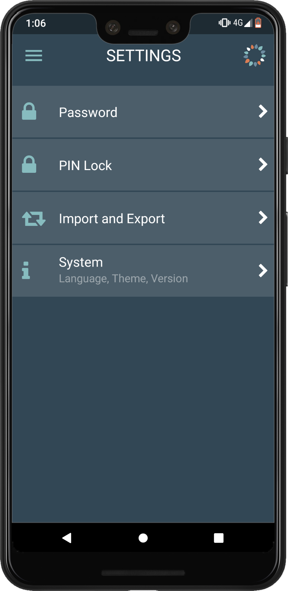

<!-- Title -->
<h1 align='center'></h1>
<h2 align="center">BeWell is an open source wellbeing tracker app with a focus on data privacy</h2>
  
What affects our wellbeing? What causes us to feel happy or upset? Sometimes we are having the worst luck or a busy and challenging day but we feel happy and collected. Yet other times we feel cranky even when everything seems to be going great. Let's try to discover some trends in our daily lives and influences on our wellbeing.

- [Introduction](#introduction)
- [Features](#features)
- [Technologies](#technologies)
- [Using the app](#using-the-app)
- [Security and Storage](#security-and-storage)
- [The Team](#the-team)
- [Contact](#contact)
- [Website](https://letsbewell.app)

## Introduction

[BeWell](https://letsbewell.app) app helps you track your moods, sleep and save notes and images throughout the day without worrying about your data being sent to servers and sold to advertisers or other third parties. Your data is yours. It is stored encrypted and stays on your device.

    
    
    

## Features

- Quick and easy mood and sleep rating by tapping on icons
- Allows adding notes and images to the wellbeing timeline
- Auto save of items added to the wellbeing timeline
- Serverless app, doesn't send your data anywhere
- Open source
- Supports Android and iOS platforms
- Password protected and secure
- Encrypted with 256-bit Advanced Encryption Standard (AES) 
- Multi language
    - Currently supports English, Russian and French. 
    - *Would you like to see your language added? [Reach out](https://www.linkedin.com/in/olena-vikariy/) and we'll work with you to make it happen!*
- Multiple themes 
    - Currently supports Dark and Light 
    - *Would you like to create one with your name? [Get in touch](https://www.linkedin.com/in/olena-vikariy/)! We'll give you a shout out here too! :-)*
- PIN Lock for faster app access
    - For extra security when using PIN lock, the app disables the ability to use PIN after 6 invalid attempts and requires to use the password instead
- Import and Export functionality for backup and restore
    - Encrypted backup file can be stored anywhere e.g. Google Drive, memory card, sent via email, etc
- Over-the-Air app updates of fixes and patches

## Technologies

   

           
   

## Using the app

### Welcome Screen

Welcome friend! Tap the 'Quick Setup' button to set up the password that will be used to secure your data. Simply follow the prompts to enter and confirm your new password and the app is ready to use.

### Home Screen

The Home screen allows adding entries such as Note, Mood, Sleep and Image to your daily wellbeing. Please note that actions on the Home screen are saved automatically eliminating the need for a save button.

The selected date is displayed below the page header. Any entries will be added to this date. To change the selected date, tap on the date text to open the date picker and select another date or use the back and forth arrows around the date text to move one day at a time.

1. **Note**

    To add a note, tap on the 'Note' icon on the Home screen and type in text in the field provided

2. **Mood**

    To add Mood, tap the 'Mood' icon on the Home screen and 
    tap one of the mood rating icons to rate your Mood

3. **Sleep**

    To add Sleep, tap the Sleep icon on the Home screen and tap one of the sleep rating icons to rate your Sleep
    - To include the time you went to bed, after you selected the sleep rating, tap 'Bed time' and select the time in the time picker
    - To include the time you woke up, after you selected the sleep rating, tap 'Wake time' and select the time in the time picker

4. **Image**

    To add an Image, tap the Image icon on the Home screen and tap the 'Pick Image' button to browse for the image on your device. Then select the desired image

### History Screen 

The History screen allows viewing past entries. They are grouped by item type (e.g. Moods, Notes, etc) showing the total number of entries for each type. Tap on the row for each type to view its corresponding entries.
- Coming soon: charts and trends!

### Settings Screen 
The Settings screen allows configuring things such as PIN lock and password, to set preferences for Language and Theme, and to Import and Export your data.

1. **Password**
    - To change your app password, tap 'Password'
        
        *If you've enabled PIN lock before, enter your PIN number when prompted*

    - Confirm your current password by entering it in the 'Confirm current password' field
    - Choose a new password by entering it in the 'Enter new password' field 
        
        *Consider choosing a passphrase with multiple separate random words with spaces for stronger protection*

    - Re-enter the password in the field below
    - Press the 'Save' button when ready to save changes

2. **PIN Lock**
    - To enable PIN Lock for faster unlocking of your app, tap 'PIN Lock'
    - Confirm your current password when prompted
    - Enter a new PIN number in the field provided
    - Re-enter your new PIN number in the field provided
    - Press 'Done'

3. **Import and Export**
    
    *Since we don't use servers to store or backup your data, it is important that you back it up yourself in case something happens to your device or you decide to move to a new device. Your exported data is encrypted but it is still wise to keep it in a safe place.*
    - Export (aka Backup) is used to save your encrypted app data to a file that can be stored anywhere you prefer
    - Import (aka Restore) is used to load data from a file that was previously created through an 'Export' operation

4. **System**
    
     *This is where you can find information about the app (e.g. App Version) and set your preferences*
    - To change the language used throughout the app, tap 'Language' and pick the desired one
    
      *Don't see your language in the list and would like to request it or provide translation yourself? [Reach out](https://www.linkedin.com/in/olena-vikariy/) and we'll make it happen!* 

    - To change the theme used throughout the app, tap 'Theme' and pick from the available choices
      
      *Would you like to create one with your name? [Get in touch](https://www.linkedin.com/in/olena-vikariy/) and we'll work with you to add it!*

### Sign Out Screen

To sign out of the app and return to the 'Login' screen, tap the 'Sign Out' button

## Security and Storage
How does the app store and secure your data?

### **Password**

When you first launch the app, a unique Data Encryption Key is generated that will be used to encrypt/decrypt your data. 

This key is encrypted with your password using 256-bit AES encryption and is stored along with your data. The password itself is not stored anywhere and needs to be provided when you log into the app.

When you provide the password, it is used to create a set of functions (decryptData, encryptData, and getHash) to be used while running the app to secure your data before persisting it to the AsyncStorage. 

### **Data Partitioning**

BeWell app stores your data on your device in AsyncStorage using name/value pair format. 

1. The data in storage is partitioned by month and that is used as the storage name. With an average of 10 wellbeing entries per day, that would make 300 entries per month which seems to be a reasonable partition size. 
    
    *For example, the data (value) for the month of July 2018 will be stored under '072018' name.* 

2. The names are hashed with Data Encryption Key using the HmacSHA256 algorithm and the data(values) are encrypted with Data Encryption Key using 256-bit AES encryption. We could have encrypted the names as well but since the names are well-known unlike the values, hashing was a superior choice for its fixed length feature.

*Please be aware that some of your configured Settings are stored unencrypted such as Theme and Language. This is done because the app needs these values before you have a chance to login and provide a password, e.g. to show the text in your language on the Sign-in screen.*

### **PIN Lock**

The app provides the ability to enable a PIN lock for easier login. The PIN has to be at least 4 digits but we recommend at least 6 for stronger security. 

1. If you choose to enable PIN lock, your Data Encryption Key will be encrypted with the key derived from your PIN number using 256-bit AES encryption. 
2. It will then be stored into [SecureStore](https://docs.expo.io/versions/latest/sdk/securestore/) which provides its own layer of encryption in addition to the one provided by the app, using the Keychain Services on iOS and Keystore System on Android platform. 
3. Any subsequent app launch will prompt for a PIN code instead of the password and will fetch the Data Encryption Key from the SecureStore and continue the login process as if you entered the password. 

*However, in case of 6 unsuccessful PIN login attempts, the app will disable the ability to login with PIN code. It will do so by removing the stored Data Encryption Key from SecureStore and prompt to login with password. After a successful login with the password, PIN lock can be re-enabled in the Settings.*

### **Authentication Flow Diagram**

## The Team

App developed and maintained by [Olena Vikariy](https://www.linkedin.com/in/olena-vikariy/). 

Code review by [Nicolas Chabra](https://www.linkedin.com/in/nchabra/). 

Logo work [Sharyn Seidel-kometz](https://www.linkedin.com/in/sharyn-seidel-kometz).

Design adapted from [Traktiv UI Kit](https://pinspiry.com/traktiv-app-free-ui-kit-xd/) in AdobeXD.

Background photos by talented creators on [Pexels](https://www.pexels.com/).

Wanna join us? If you like BeWell and want to help make it better then [get in touch](https://www.linkedin.com/in/olena-vikariy/) or check out the [BeWell repo](https://github.com/ovikariy/bewell) to work on the code. 

## Contact

[Olena Vikariy](https://www.linkedin.com/in/olena-vikariy/)